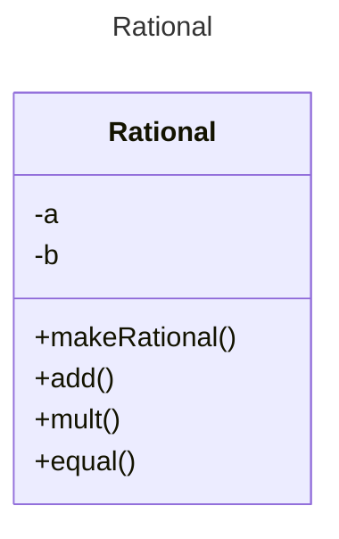

# Proyecto - Recursividad

## Descripción del Problema

**Este ejercicio muestra diferentes algoritmos implementos de forma iterativa y recursiva**

## Ejecución

Tu programa debería ejecutarse de la siguiente manera:


**1. Alfabeto**
======================
El algoritmo para imprimir el alfabeto utilizando recursividad indirecta se basa en la idea de utilizar una función auxiliar que se llama a sí misma para imprimir las letras del alfabeto. La función principal solo se encarga de llamar a la función auxiliar una vez para iniciar el proceso de impresión.

Pasos del algoritmo:

Definir una función auxiliar: Se define una función auxiliar que recibe un caracter como parámetro. La función auxiliar se encarga de imprimir el caracter que recibe como parámetro y luego llamarse a sí misma con el siguiente caracter del alfabeto.
Definir la función principal: Se define la función principal que no recibe ningún parámetro. La función principal solo se encarga de llamar a la función auxiliar con la letra a como parámetro para iniciar el proceso de impresión.
Llamar a la función principal: Se llama a la función principal para iniciar el proceso de impresión del alfabeto.


**2. Búsqueda Binaria**
=======================
La búsqueda binaria recursiva es un algoritmo para encontrar un elemento específico dentro de una lista ordenada. La idea principal es dividir la lista en dos mitades iguales en cada iteración, y luego descartar la mitad que no puede contener el elemento buscado.

El problema con la búsqueda binaria recursiva surge cuando se busca un elemento que no está presente en la lista. En este caso, la función recursiva seguirá dividiendo la lista en dos mitades, pero nunca encontrará el elemento buscado. Esto puede llevar a una búsqueda infinita, donde la función recursiva se llama a sí misma indefinidamente.


**3. Factorial**
========================
El factorial de un número natural n se define como el producto de todos los números naturales menores o iguales a n. Por ejemplo, 5! = 5 \times 4 \times 3 \times 2 \times 1 = 120.

El cálculo del factorial de un número se puede realizar de forma recursiva, utilizando una función que se llama a sí misma. La idea principal es que la función factorial de n se calcula como el producto de n por el factorial de n-1.

Ejemplo:

Para calcular 5!, la función factorial primero calcula el factorial de 4, que es 4! = 24. Luego, la función multiplica 5 por 24 para obtener el resultado final: 5! = 5 \times 24 = 120.

El problema surge cuando se calcula el factorial de números grandes. La función recursiva puede llegar a un punto en el que el valor de n es tan grande que el producto de n por el factorial de n-1 supera la capacidad de la computadora para almacenar números. Esto puede provocar un error de desbordamiento de pila.


**4. Fibonaci**
========================
La sucesión de Fibonacci es una serie de números en la que cada número es la suma de los dos anteriores. La sucesión comienza con 0 y 1, y luego continúa con 1 (0 + 1), 2 (1 + 1), 3 (1 + 2), 5 (2 + 3), 8 (3 + 5), 13 (5 + 8), y así sucesivamente.

El cálculo del número Fibonacci de un número n se puede realizar de forma recursiva, utilizando una función que se llama a sí misma. La idea principal es que el número Fibonacci de n se calcula como la suma del número Fibonacci de n-1 y el número Fibonacci de n-2.

Ejemplo:

Para calcular el número Fibonacci de 5, la función Fibonacci primero calcula el número Fibonacci de 4, que es 3, y el número Fibonacci de 3, que es 2. Luego, la función suma estos dos valores para obtener el resultado final: F(5) = F(4) + F(3) = 3 + 2 = 5.

El problema surge cuando se calcula el número Fibonacci de un número grande. La función recursiva puede llegar a un punto en el que el valor de n es tan grande que el cálculo de F(n-1) y F(n-2) toma demasiado tiempo. Esto puede provocar que el programa se ralentice o incluso se quede sin memoria.


**5. Fibonacci Recursivo de 40 a 50**
=====================================
Calcula una serie de números de fibonacci entre 40 y 50 para mostrar como el calculo incrementa
Luego se ve la forma de solucionarlo, utilizando una estructura HashTable.
Utilizamos la clase Performace para medir su tiempo.


**6. Ladrillos**
========================
Imprime una una "pared" formada por n filas de ladrillos de forma recursiva,
los ladrillos se representan con la letra X


**7. Máximo Común Divisor**
===========================
El máximo común divisor (MCD) de dos números enteros positivos es el mayor número que divide a ambos números sin dejar resto. El MCD se puede calcular de forma recursiva utilizando el algoritmo de Euclides.

El algoritmo de Euclides:

El algoritmo de Euclides es un método eficiente para calcular el MCD de dos números. La idea principal es que el MCD de dos números a y b se puede calcular como el MCD de b y el resto de la división de a entre b.

Ejemplo:

Para calcular el MCD de 12 y 16, se realiza la siguiente división:

12 | 16
4 | 12
3 | 4
1 | 3
El resto de la última división es 1, por lo que el MCD de 12 y 16 es 1.

El problema:

El problema del cálculo del MCD recursivo surge cuando se calcula el MCD de dos números muy grandes. La función recursiva puede llegar a un punto en el que el valor de a y b son tan grandes que el cálculo del resto de la división toma demasiado tiempo. Esto puede provocar que el programa se ralentice o incluso se quede sin memoria.

Soluciones:

Existen varias soluciones al problema del cálculo del MCD recursivo:

Utilizar una función iterativa: Se puede calcular el MCD de dos números utilizando una función iterativa, que no se llama a sí misma. La función iterativa es más simple y eficiente que la función recursiva, y no tiene el problema de la lentitud o la falta de memoria.


**8. Números Naturales**
========================
El algoritmo para calcular números naturales de forma recursiva se basa en la idea de que cada número natural se puede definir en función de sus predecesores. La forma más común de hacerlo es mediante la siguiente ecuación:

n = n-1 + 1
Donde:

n es el número natural que queremos calcular.
n-1 es el predecesor inmediato de n.
Esta ecuación se puede interpretar como que para obtener un número natural, simplemente sumamos 1 al número anterior.

Ejemplo:

Para calcular el número 5, podemos utilizar la siguiente secuencia de pasos:

Comenzamos con el número 0 (el predecesor de 1).
Sumamos 1 a 0, obteniendo 1.
Sumamos 1 a 1, obteniendo 2.
Sumamos 1 a 2, obteniendo 3.
Sumamos 1 a 3, obteniendo 4.
Sumamos 1 a 4, obteniendo 5.
De esta forma, hemos calculado el número 5 de forma recursiva.

Ventajas de la recursividad:

La recursividad permite definir números naturales de forma simple y elegante.
La recursividad facilita la comprensión de la relación entre los números naturales.
La recursividad se puede utilizar para definir otros tipos de objetos matemáticos, como las listas y los árboles.
Desventajas de la recursividad:

La recursividad puede ser ineficiente para calcular números grandes, ya que la función recursiva se llama a sí misma muchas veces.
La recursividad puede ser difícil de entender para algunos principiantes.
En general, la recursividad es una herramienta poderosa para definir y calcular números naturales. Sin embargo, es importante tener en cuenta las ventajas y desventajas de la recursividad antes de utilizarla en un programa específico.


**9. Ordenamiento por Selección**
=================================
El ordenamiento por selección es un algoritmo de ordenamiento simple que funciona seleccionando el elemento más pequeño de una lista y colocándolo al principio de la lista. Este proceso se repite hasta que la lista esté ordenada.

El problema surge cuando se intenta implementar el ordenamiento por selección utilizando recursividad. La recursividad implica que la función se llama a sí misma para resolver el problema. En el caso del ordenamiento por selección, esto significa que la función se llamará a sí misma una vez por cada elemento de la lista.

Ejemplo:

Supongamos que tenemos una lista de 5 elementos: [5, 2, 4, 6, 1]. La función de ordenamiento por selección recursiva se llamará a sí misma 5 veces:

La primera vez, la función seleccionará el elemento más pequeño de la lista, que es 1.
La segunda vez, la función se llamará a sí misma con la lista [2, 4, 6, 5]. La función seleccionará el elemento más pequeño de esta lista, que es 2.
La tercera vez, la función se llamará a sí misma con la lista [4, 6, 5]. La función seleccionará el elemento más pequeño de esta lista, que es 4.
La cuarta vez, la función se llamará a sí misma con la lista [6, 5]. La función seleccionará el elemento más pequeño de esta lista, que es 5.
La quinta vez, la función se llamará a sí misma con la lista [6]. Como solo hay un elemento en la lista, la función no necesita hacer nada.
El problema con este enfoque es que puede ser muy ineficiente para listas grandes. La función recursiva se llama a sí misma una vez por cada elemento de la lista, lo que significa que el número de llamadas recursivas es proporcional al tamaño de la lista.

Soluciones:

Existen varias soluciones al problema del ordenamiento por selección recursivo:

1. Implementar el ordenamiento por selección de forma iterativa:

El ordenamiento por selección iterativo es más eficiente que el ordenamiento por selección recursivo. La función iterativa solo recorre la lista una vez, mientras que la función recursiva la recorre una vez por cada elemento.

2. Utilizar un algoritmo de ordenamiento más eficiente:

Existen algoritmos de ordenamiento más eficientes que el ordenamiento por selección, como el ordenamiento por mezcla o el ordenamiento rápido. Estos algoritmos son más eficientes para listas grandes.

3. Convertir la recursividad en cola:

En algunos casos, es posible convertir una función recursiva en una función iterativa utilizando una técnica llamada "conversión de recursividad en cola". Esto puede mejorar el rendimiento del programa al evitar el desbordamiento de la pila.

En general, se recomienda evitar el uso del ordenamiento por selección recursivo para ordenar listas grandes. En estos casos, las soluciones alternativas como el ordenamiento por selección iterativo o los algoritmos de ordenamiento más eficientes son generalmente más eficientes y confiables.

**10. Suma de Dígitos**
========================
El algoritmo recursivo para sumar los dígitos de un número funciona dividiendo el número en dos partes: el dígito más a la derecha y el resto del número. Luego, se suma el dígito más a la derecha al resultado de sumar los dígitos del resto del número.

**11. Performance**
========================
Se utiliza para medir los tiempos en ejecutarse un algoritmo.
La variable *ti*(tiempo inicial) se asigna la hora, expresada en milisegundos, de inicio de la medición; y el la variable *tf* (tiempo final) se asigna la hora de finalización de la medición
Los métodos *start* y *stop* permiten asignar la hora de inicio y la hora de fin a las variables *ti* y *tf*respectivamente. El método *getMillis* retorma la diferencia *tf-ti *que coincidirá con el tiempo transcurrido entre la invocación de los métodos *start* y *stop*


```


## Diagrama de clases
[Editor en línea](https://mermaid.live/)

[Referencia-Mermaid](https://mermaid.js.org/syntax/classDiagram.html)

## Diagrama de clases UML con draw.io
El repositorio está configurado para crear Diagramas de clases UML con ```draw.io```. Para usarlo simplemente agrega un archivo con extensión ```.drawio.png```, das doble clic sobre el mismo y se activará el editor ```draw.io``` incrustado en ```VSCode``` para edición. Asegúrate de agregar las formas UML en el menú de formas del lado izquierdo (opción ```+Más formas```).
## Uso del proyecto con make

### Default - Compilar+Probar+Ejecutar
```
make
```
### Compilar
```
make compile
```
### Probar todo
```
make test
```
### Ejecutar App
```
make run
```
### Limpiar binarios
```
make clean
```
## Comandos Git-Cambios y envío a Autograding

### Por cada cambio importante que haga, actualice su historia usando los comandos:
```
git add .
git commit -m "Descripción del cambio"
```
### Envíe sus actualizaciones a GitHub para Autograding con el comando:
```
git push origin main
```
## Comandos individuales
### Compilar

```
find ./ -type f -name "*.java" > compfiles.txt
javac -d build -cp lib/junit-platform-console-standalone-1.5.2.jar @compfiles.txt
```
### Ejecutar ambos comandos en 1 sólo paso:
```
find ./ -type f -name "*.java" > compfiles.txt ; javac -d build -cp lib/junit-platform-console-standalone-1.5.2.jar @compfiles.txt
```

### Ejecutar Todas la pruebas locales de 1 Test Case
```
java -jar lib/junit-platform-console-standalone-1.5.2.jar -class-path build --select-class miTest.AppTest
```
### Ejecutar 1 prueba local de 1 Test Case
```
java -jar lib/junit-platform-console-standalone-1.5.2.jar -class-path build --select-method miTest.AppTest#appHasAGreeting
```
### Ejecutar App
```
java -cp build miPrincipal.Principal
```
Los comandos anteriores están considerados para un ambiente Linux. [Referencia.](https://www.baeldung.com/junit-run-from-command-line)
